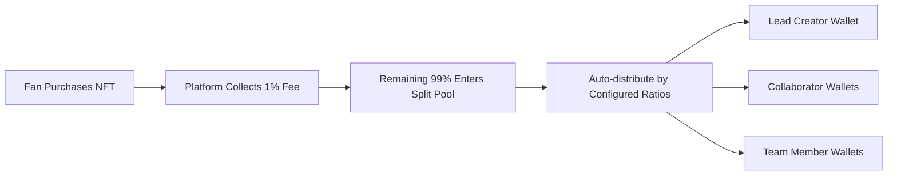

# SatScribe - Decentralized Creator Revenue Sharing Platform

<div align="center">
  
  
  **Every support recorded forever. True creator revenue autonomy.**
  
  [](https://stacks.co)
  [](https://vuejs.org)
  [](https://clarity-lang.org)
  [](LICENSE)
</div>

---

## Problem Statement

### Web2 Platform Trust Crisis
The creator economy faces systemic issues that undermine sustainable collaboration:

- **Revenue Disputes**: Team collaborations lack transparent revenue distribution mechanisms
- **Platform Dependency**: Creator income relies entirely on opaque platform data with no independent verification
- **Trust Breakdown**: As revenue scales, human-based governance models frequently collapse
- **Data Opacity**: Black-box operations between fan support and creator earnings create uncertainty

### SatScribe Solution
> **Blockchain-native infrastructure that eliminates trust risks in creator revenue sharing**

- **On-chain Transparency**: All revenue distributions publicly verifiable on blockchain
- **Smart Contract Execution**: Automated profit-sharing eliminates human intervention
- **Collectible Support Proof**: Fan support converted to Soulbound NFT certificates
- **True Creator Autonomy**: Complete control over revenue distribution rules

---

## Core Innovation

### Transparent Revenue Distribution
```
Fan Support: 10 STX
├── Platform Fee (1%): 0.1 STX  
└── Creator Revenue (99%): 9.9 STX
    ├── Lead Creator (70%): 6.93 STX
    ├── Artist (20%): 1.98 STX  
    └── Editor (10%): 0.99 STX
```

### Soulbound Subscription Badges
- **Non-transferable**: Authentic support proof preventing speculation
- **Quarterly System**: Season-based subscription model enhancing fan retention
- **Collectible Nature**: Each badge represents unique digital memorabilia
- **Auto-expiration**: Automatic invalidation at quarter end ensuring time-bound access

### Intelligent Revenue Splitting
- **Dynamic Configuration**: Real-time adjustment of team profit-sharing ratios  
- **Instant Execution**: Automated revenue distribution without manual intervention
- **Complete Transparency**: All splitting records permanently recorded on-chain
- **Multi-member Support**: Up to 10 team members per revenue split configuration

---

## Technical Architecture

### Blockchain Layer (Stacks)
```
Smart Contract Ecosystem
├── subscription-nft.clar      # Soulbound Subscription NFT Contract
├── revenue-splitter.clar      # Revenue Distribution Engine  
├── creator-registry.clar      # Creator Registration & Management
└── platform-treasury.clar    # Platform Fee Management (1%)
```

### Frontend Application (Vue 3)
```
Modern Web3 Interface
├── Vue 3 + Vite + TypeScript  # Modern frontend framework
├── Tailwind CSS              # Professional UI design system
├── Pinia                     # State management
├── @stacks/connect           # Wallet integration (Leather Wallet)
└── Responsive Design         # Desktop & mobile optimized
```

### Backend Services (Node.js)
```
High-performance API Layer
├── Express.js                # RESTful API framework
├── Multer + Sharp           # Image processing & optimization
├── NFT Metadata Generation  # Standards-compliant NFT formatting
└── CORS Security            # Secure cross-origin communication
```

---

## Core Features

### Creator Dashboard
- **Identity Registration**: On-chain creator identity verification
- **NFT Issuance**: Create quarterly subscription badges with pricing & supply controls
- **Team Management**: Configure revenue split members & percentages (must total 100%)
- **Revenue Analytics**: Real-time income, subscriber metrics, and performance insights
- **Content Management**: Upload NFT artwork, write descriptions, manage metadata

### User Experience
- **Content Discovery**: Browse creators and latest subscription offerings
- **Subscription Purchase**: STX-based subscription badge acquisition
- **Collection Display**: Personal subscription badge portfolio management
- **Access Verification**: NFT ownership validation and expiration status checking

### Smart Contract Features
- **Soulbound Mechanics**: Non-transferable NFTs preventing speculation
- **Automatic Expiration**: Quarter-end automatic badge invalidation
- **Instant Revenue Split**: Purchase-triggered automatic revenue distribution
- **Decentralized Governance**: No single point of failure, censorship-resistant

---

## Economic Model

### Fee Structure
| Component | Percentage | Purpose |
|-----------|------------|---------|
| Platform Fee | 1% | Platform maintenance & development |
| Creator Revenue | 99% | Net income to creator ecosystem |

### Revenue Flow


---

## Quick Start

### Prerequisites
- **Node.js** 18+ 
- **npm** or **yarn**
- **Clarinet** (Smart contract development)
- **Leather Wallet** browser extension

### Installation & Setup

```bash
# Clone repository
git clone https://github.com/your-username/satscribe.git
cd satscribe

# Install dependencies
cd frontend && npm install
cd ../backend && npm install

# Start development environment
npm run dev  # Backend API (Port 3001)
cd ../frontend && npm run dev  # Frontend app (Port 3000)

# Start Clarinet local network
cd contracts && clarinet integrate
```

---

## Project Structure

```
satscribe/
├── frontend/                 # Vue 3 Frontend Application
│   ├── src/views/
│   │   ├── user/           # User-facing pages
│   │   └── creator/        # Creator dashboard pages
│   ├── stores/             # Pinia state management
│   └── components/         # Reusable Vue components
├── backend/                  # Node.js Backend Services
│   ├── server.js           # Express server
│   └── uploads/            # Image storage
├── contracts/               # Clarity Smart Contracts
│   ├── contracts/          # Contract source files
│   └── tests/              # Contract test suites
└── README.md
```
---

## Testing

```bash
# Smart Contract Testing
cd contracts
npm test
npm run test:coverage

# Frontend Testing
cd frontend
npm run test:unit
npm run test:e2e
```

---

## Deployment Information

### Testnet Deployment
- **Contract Address**: `ST2FGWKW4M6KBY2P19WZRDH9TCDMGMTDGA2D301HQ`
- **Network**: Stacks Testnet
- **Wallet**: Leather Wallet

---

<div align="center">
  
**SatScribe** - Empowering creators with transparent, blockchain-native revenue sharing

*Built with ❤️ on Stacks Blockchain*

**Making creator collaboration trustless, transparent, and sustainable**

</div>
